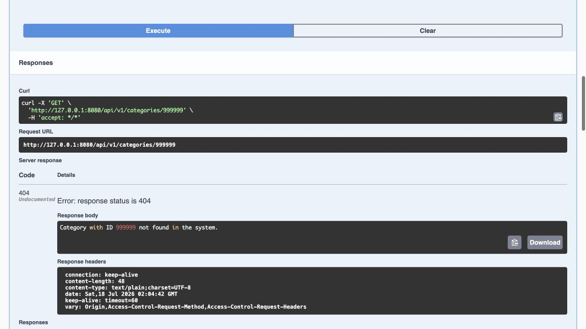

# Kütüphane Yönetim Sistemi

Kütüphaneler tarafından kullanılabilecek kayıt yönetimlerini, kitap ödünç verme ve alma işlemlerini yapabilecekleri Rest API projesidir.

> **Fork durumu:** Bu depo, [gorbadil/LibraryAppSpringBoot](https://github.com/gorbadil/LibraryAppSpringBoot) projesinin fork'udur; özgün projenin tamamı Okan'a aitmiş gibi sunulmaz. [Okan'ın upstream'den sonraki 10 commit'i](https://github.com/gorbadil/LibraryAppSpringBoot/compare/main...okturan:main) örnek veri yükleme, global hata yönetimi, repository/service düzeltmeleri, tek alanlı kategori ve yayınevi güncelleme hataları, silme hataları, Docker veri davranışı ve kurulum dokümantasyonu üzerinde çalışır.

## Okan Tarafından Eklenen Farklar

- Tekrarlanabilir örnek kütüphane verisi üreten `DataLoader`.
- API hatalarını tutarlı yanıtlara dönüştüren global exception handler.
- Yalnız adres/açıklama alanı değiştiğinde başarısız olan yayınevi ve kategori güncellemelerinin düzeltilmesi.
- Silme hatalarının ve repository sorgularının iyileştirilmesi.
- Java 17'ye sabitlenmiş container build/runtime aşamaları ve PostgreSQL servis sağlık kontrolü.
- Kaynakta parola tutmayan Compose yapılandırması ve Java 17/PostgreSQL CI doğrulaması.

## Canlı API Kanıtı

*Gerçek Java 17/PostgreSQL 16 container çalıştırmasından alınmıştır. Swagger UI, `DataLoader` tarafından üretilen sentetik yerel veriler üzerinde `GET /api/v1/categories/999999` isteğini çalıştırır; fork'ta eklenen global hata yönetimi de tam 404 yanıtını üretir. Bu, barındırılan bir demo değil, yerel ve tekrar üretilebilir bir çalışma kanıtıdır.*

## Kullanılan Teknolojiler

<code></code>
<code></code>
<code></code>
<code></code>
<code></code>
<code></code>
<code></code>
<code></code>
<code></code>
<code></code>

## Özellikler

- Yazar, kategori, yayınevi ekleme, güncelleme, silme işlemleri yapılır.
- Kitapların stok bilgileri tutulur.
- Kitapların ödünç verme ve geri alma kayıtları tutulur.

## Ekran Görüntüleri

- UML diyagram
  

## API Kullanımı

Aşağıda, API'nin sunduğu temel endpoint'lerin bir listesi bulunmaktadır:

| Endpoint                  | HTTP Metodu | Açıklama                                            |
| ------------------------- | :---------- | --------------------------------------------------- |
| **author**                |             |                                                     |
| `/api/v1/authors/{id}`    | GET         | Belirtilen ID'ye sahip yazarı getirir               |
| `/api/v1/authors/{id}`    | PUT         | Belirtilen ID'ye sahip yazarı günceller             |
| `/api/v1/authors/{id}`    | DELETE      | Belirtilen ID'ye sahip yazarı siler                 |
| `/api/v1/authors`         | GET         | Tüm yazarları getirir                               |
| `/api/v1/authors`         | POST        | Yazar ekler                                         |
|                           |             |                                                     |
| **publisher**             |             |                                                     |
| `/api/v1/publishers/{id}` | GET         | Belirtilen ID'ye sahip yayınevini getirir           |
| `/api/v1/publisher/{id}`  | PUT         | Belirtilen ID'ye sahip yayınevini günceller         |
| `/api/v1/publisher/{id}`  | DELETE      | Belirtilen ID'ye sahip yayınevini siler             |
| `/api/v1/publisher`       | GET         | Tüm yayınevlerini getirir                           |
| `/api/v1/publisher`       | POST        | Yayınevi ekler                                      |
|                           |             |                                                     |
| **category**              |             |                                                     |
| `/api/v1/categories/{id}` | GET         | Belirtilen ID'ye sahip kategoriyi getirir           |
| `/api/v1/categories/{id}` | PUT         | Belirtilen ID'ye sahip kategoriyi günceller         |
| `/api/v1/categories/{id}` | DELETE      | Belirtilen ID'ye sahip kategoriyi siler             |
| `/api/v1/categories`      | GET         | Tüm kategorileri getirir                            |
| `/api/v1/categories`      | POST        | Kategori ekler                                      |
|                           |             |                                                     |
| **book**                  |             |                                                     |
| `/api/v1/books/{id}`      | GET         | Belirtilen ID'ye sahip kitabı getirir               |
| `/api/v1/books/{id}`      | PUT         | Belirtilen ID'ye sahip kitabı günceller             |
| `/api/v1/books/{id}`      | DELETE      | Belirtilen ID'ye sahip kitabı siler                 |
| `/api/v1/books`           | GET         | Tüm kitapları getirir                               |
| `/api/v1/books`           | POST        | Kitap ekler                                         |
|                           |             |                                                     |
| **book borrowing**        |             |                                                     |
| `/api/v1/borrows/{id}`    | GET         | Belirtilen ID'ye sahip kitap ödünç almayı getirir   |
| `/api/v1/borrows/{id}`    | PUT         | Belirtilen ID'ye sahip kitap ödünç almayı günceller |
| `/api/v1/borrows/{id}`    | DELETE      | Belirtilen ID'ye sahip kitap ödünç almayı siler     |
| `/api/v1/borrows`         | GET         | Tüm kitap ödünç almaları getirir                    |
| `/api/v1/borrows`         | POST        | kitap ödünç alma ekler                              |

## Kurulum

1. Projeyi klonlayın.
    - `git clone https://github.com/okturan/LibraryAppSpringBoot.git`
2. Docker yüklü ise,
    1. `cp .env.example .env`
    2. `.env` içindeki yerel veritabanı kullanıcı adı ve parolasını değiştirin.
    3. `docker compose up --build`
3. Docker olmadan çalıştırmak için aşağıdaki ortam değişkenlerini tanımlayıp `./mvnw spring-boot:run` komutunu kullanın.
4. Swagger üzerinden API kullanılabilir. Tarayıcınızdan [http://localhost:8080/swagger-ui/index.html#/](http://localhost:8080/swagger-ui/index.html#/)'e gidin.
5. End pointlere istek atabilirsiniz.

## Ortam Değişkenleri

Bu projeyi çalıştırmak için aşağıdaki ortam değişkenlerini tanımlayın; gerçek kimlik bilgilerini `application.properties`, `.env.example` veya Git geçmişine yazmayın.

- `DBURL` — ör. `localhost:5432`
- `DBNAME` — ör. `library-app`
- `DBUSERNAME`
- `DBPASSWORD`

## Doğrulama

GitHub Actions, PostgreSQL servis konteyneri üzerinde Java 17 ile Maven testlerini ve paketlemeyi çalıştırır; ardından Compose yapılandırmasının örnek ortam dosyasıyla çözümlendiğini ve uygulama container'ının Java 17 tabanında üretildiğini doğrular. Bu bir fork olduğundan, doğrulama Okan'ın farkını kanıtlar; upstream kaynakların yazarlığını değiştirmez.

## Lisans

[MIT](https://choosealicense.com/licenses/mit/)
